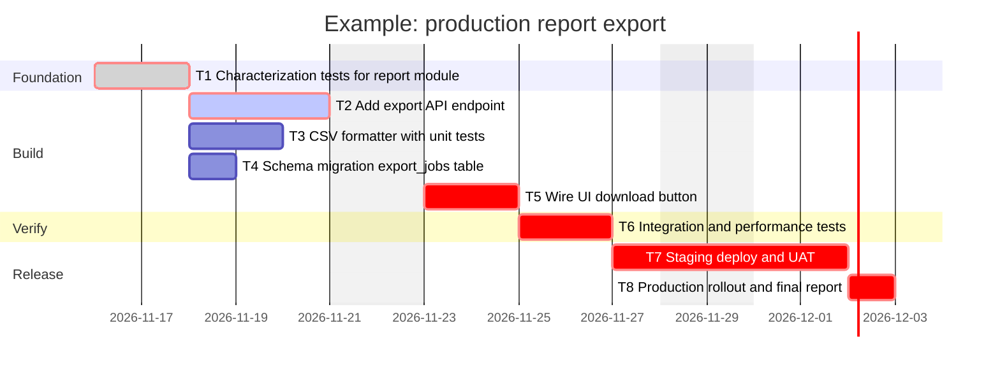

```mermaid
gantt
    title Example: production report export
    dateFormat YYYY-MM-DD
    excludes weekends
    section Foundation
    T1 Characterization tests for report module :done, crit, T1, 2026-11-16, 2026-11-18
    section Build
    T2 Add export API endpoint :active, crit, T2, 2026-11-18, 2026-11-21
    T3 CSV formatter with unit tests :T3, 2026-11-18, 2026-11-20
    T4 Schema migration  export_jobs table :T4, 2026-11-18, 2026-11-19
    T5 Wire UI download button :crit, T5, 2026-11-23, 2026-11-25
    section Verify
    T6 Integration and performance tests :crit, T6, 2026-11-25, 2026-11-27
    section Release
    T7 Staging deploy and UAT :crit, T7, 2026-11-27, 2026-12-02
    T8 Production rollout and final report :crit, T8, 2026-12-02, 2026-12-03
```
